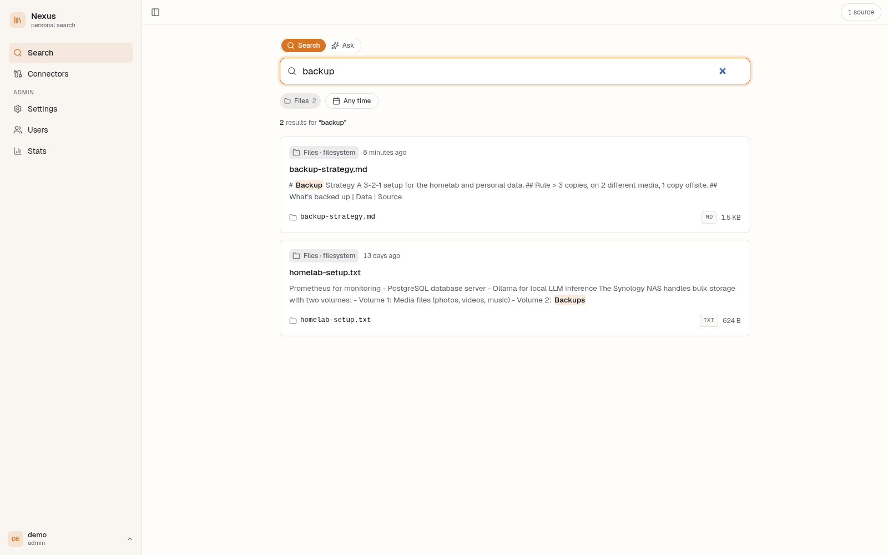
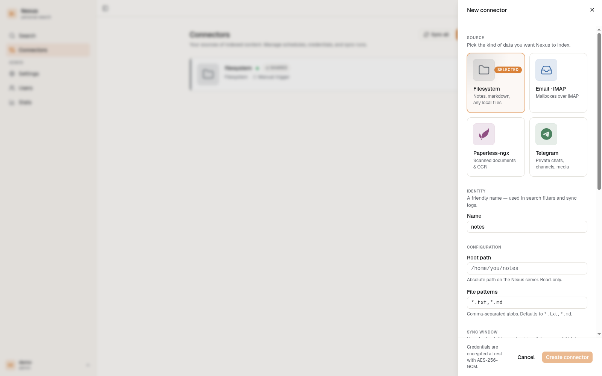
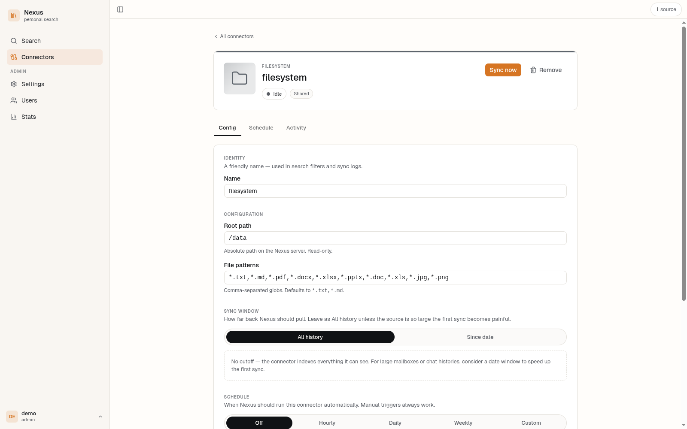
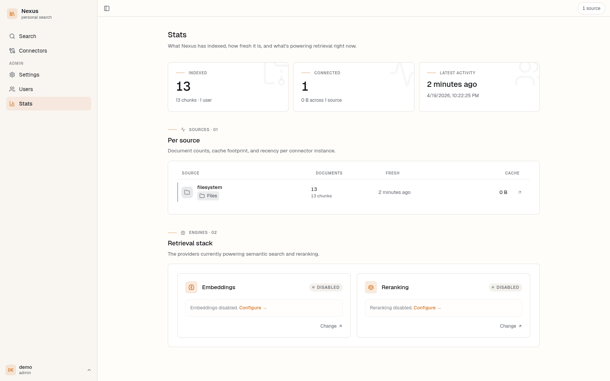
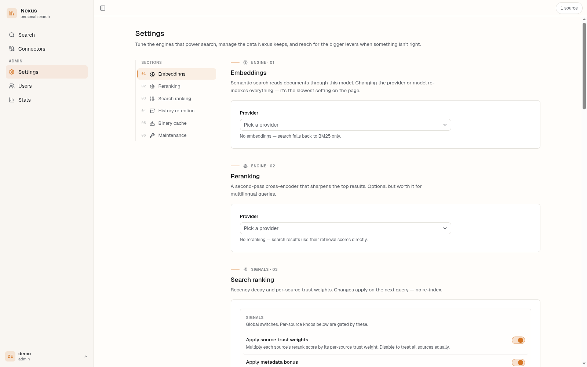

# Nexus

A self-hosted personal search engine. Point it at your files, email, chats and
scanned documents, and get one search box that finds anything across all of
them — with highlighted snippets, hybrid ranking, and optional semantic search.




<p align="center">
  <a href="https://github.com/yasen-pavlov/nexus/actions/workflows/ci.yml"></a>
  <a href="https://github.com/yasen-pavlov/nexus/releases"></a>
  <a href="LICENSE"></a>
  <a href="https://ghcr.io/yasen-pavlov/nexus"></a>
</p>

## What it does

- **One search box, many sources.** Filesystem, IMAP email, Telegram, Paperless-ngx — all queried together with per-source filters, highlighted snippets, and source-aware ranking.
- **Hybrid search.** BM25 full-text retrieval and optional dense-vector retrieval are merged with reciprocal rank fusion (RRF), then re-scored by a dedicated reranker. Works in plain BM25 mode out of the box; light up the rest by configuring an embedding provider in Settings.
- **Plug-in connectors.** Each source is a Go package that implements `Connector` (fetch + cursor-based incremental sync). Adding a new one is a day's work.
- **Scheduled syncs.** Cron-backed scheduler runs connectors automatically; every sync is recorded with progress streamed live over Server-Sent Events and a cancellation hook.
- **Conversation browser.** Telegram and IMAP threads are indexed as conversation windows instead of one-message-per-document, so embeddings actually have context. A dedicated chat-style viewer lets you jump around inside a thread after a hit.
- **Multi-user, auth-scoped.** Username + bcrypt password, JWT sessions, two roles (admin/user). Every search result is scoped to the calling user — shared connectors (e.g. the family NAS) are visible to everyone, personal connectors (your email) are not.
- **Single container to run.** One binary serves the React frontend and the API. The only hard dependencies are Postgres and OpenSearch.

## See it

| | |
| --- | --- |
| First boot asks you to create the admin account. No mandatory SaaS signup, no "enterprise" tier. |  |
| Drop in any combination of Filesystem, IMAP, Paperless-ngx, or Telegram. Credentials are encrypted at rest with AES-256-GCM. |  |
| Each connector page shows config, sync schedule, and full run history. |  |
| Stats keep an eye on what's indexed, how fresh it is, and which retrieval stack is active. |  |
| Tune the retrieval stack — pick embedding and reranking providers, set source trust weights and recency half-lives. |  |

## Quick start

Requirements: Docker Engine 24+ with the Compose plugin. That's it.

```sh
git clone https://github.com/yasen-pavlov/nexus.git
cd nexus
cp .env.example .env

# Generate the two required secrets and drop them into .env
echo "NEXUS_ENCRYPTION_KEY=$(openssl rand -hex 32)" >> .env
echo "NEXUS_JWT_SECRET=$(openssl rand -base64 48)"  >> .env

docker compose --profile app up -d
```

Open <http://localhost:8080>. The first account you create becomes the admin.

A bundled `testdata/` directory is mounted read-only as the default data source
so you have something to search right away. Point `NEXUS_DATA_PATH` at your
real files once you're ready.

### Using local embeddings (optional)

By default Nexus runs in BM25-only mode. To enable semantic search without
sending anything to a cloud provider:

```sh
docker compose --profile app --profile ollama up -d
```

Then open **Settings → Embeddings** and pick `Ollama`. You can also point it at
OpenAI, Voyage, or Cohere — the same UI, just a different provider.

## Data sources

| Connector      | What it indexes                                                                | Incremental sync                |
| -------------- | ------------------------------------------------------------------------------ | ------------------------------- |
| Filesystem     | Any directory tree. Text, markdown, PDF, Office docs, images (OCR via Tika).   | Mtime + content hash            |
| IMAP           | Any IMAP mailbox (iCloud, Gmail app passwords, Fastmail…). Bodies are cleaned — tracking redirects and RFC 3676 signatures are dropped before embedding. | `UIDNEXT` + UID cursor          |
| Telegram       | Private chats, groups, and channels you're a member of. Messages are grouped into 30-minute conversation windows for richer embeddings. Attachments download to the local binary cache. | Last seen message ID per chat   |
| Paperless-ngx  | Scanned documents and OCR text from your Paperless instance.                   | `modified__gt` timestamp cursor |

All credentials are encrypted with AES-256-GCM using `NEXUS_ENCRYPTION_KEY`
before they touch the database.

## How search works

A query goes through three stages:

1. **Retrieval.** Both BM25 (OpenSearch, with per-language analyzers for
   English, Bulgarian and German) and dense vectors (if an embedding provider
   is configured) run in parallel.
2. **Fusion.** Reciprocal rank fusion merges the two ranked lists. RRF is
   pure rank math, not a relevance score — nothing is filtered here.
3. **Reranking.** Top candidates are deduped and sent to a cross-encoder
   (Voyage `rerank-2` or Cohere `rerank-3`). The reranker returns a calibrated
   relevance score, which *is* filterable — results below the floor (default
   0.12) are dropped.

On top of that, a source-aware scoring layer applies:

- a **half-life** per source (email decays fast, filesystem slowly),
- a **recency floor** so old documents stop bleeding score forever, and
- a **trust weight** per source (Paperless > IMAP > Telegram by default).

All three constants live next to the connector definition, so adding a new
source requires one change.

## Configuration

Everything is an environment variable prefixed with `NEXUS_`. Anything marked
*required* must be in your `.env`; everything else has a sensible default.

| Variable                    | Required | Default                                                                   | Purpose                                                               |
| --------------------------- | :------: | ------------------------------------------------------------------------- | --------------------------------------------------------------------- |
| `NEXUS_ENCRYPTION_KEY`      | yes      | —                                                                         | 64 hex chars (32 bytes) for AES-256-GCM. Lose it, lose every credential. |
| `NEXUS_JWT_SECRET`          | yes*     | random per boot                                                           | Signs session tokens. Set it, or every restart logs everyone out.     |
| `NEXUS_DATABASE_URL`        | yes      | —                                                                         | Postgres connection string. Set in compose automatically.             |
| `NEXUS_OPENSEARCH_URL`      | no       | `http://localhost:9200`                                                   | OpenSearch endpoint.                                                  |
| `NEXUS_TIKA_URL`            | no       | (unset — Tika calls fall back to basic extraction)                        | Apache Tika endpoint for rich binary extraction / OCR.                |
| `NEXUS_OLLAMA_URL`          | no       | `http://localhost:11434`                                                  | Ollama endpoint for local embeddings.                                 |
| `NEXUS_PORT`                | no       | `8080`                                                                    | HTTP port the app listens on.                                         |
| `NEXUS_LOG_LEVEL`           | no       | `info`                                                                    | `info` or `debug`.                                                    |
| `NEXUS_CORS_ORIGINS`        | no       | `http://localhost:5173`                                                   | Comma-separated allowed origins.                                      |
| `NEXUS_BINARY_STORE_PATH`   | no       | `/var/lib/nexus/binaries` (compose) / temp dir (local)                    | On-disk cache for Telegram/IMAP attachments and file binaries.        |
| `NEXUS_FS_ROOT_PATH`        | no       | —                                                                         | On first boot, seeds a shared Filesystem connector at this path.      |
| `NEXUS_FS_PATTERNS`         | no       | `*.txt,*.md`                                                              | Comma-separated glob patterns for the seeded Filesystem connector.    |
| `NEXUS_EMBEDDING_PROVIDER`  | no       | (configured via UI)                                                       | `ollama` \| `openai` \| `voyage` \| `cohere` — forces the provider.   |
| `NEXUS_EMBEDDING_MODEL`     | no       | provider-specific                                                         | Overrides the default model for the provider above.                   |
| `NEXUS_EMBEDDING_API_KEY`   | no       | —                                                                         | API key for OpenAI/Voyage/Cohere.                                     |
| `NEXUS_RERANK_PROVIDER`     | no       | (configured via UI)                                                       | `voyage` \| `cohere`.                                                 |
| `NEXUS_RERANK_MODEL`        | no       | provider-specific                                                         | Overrides the default reranker model.                                 |
| `NEXUS_RERANK_API_KEY`      | no       | falls back to `NEXUS_EMBEDDING_API_KEY` when the provider matches         | API key for the reranker.                                             |

\* *Required in the strict sense that omitting it works, but every restart invalidates every session — not what you want in production.*

Provider credentials and most of the scoring knobs are also editable live from
the Settings UI without restarting the container.

## Development

Requirements: Go 1.26+, Node.js 24+, Docker.

```sh
cp .env.example .env
# fill in NEXUS_ENCRYPTION_KEY / NEXUS_JWT_SECRET as above

make dev                    # starts Postgres/OpenSearch/Tika in Docker, runs the Go app locally
cd web && npm install && npm run dev   # starts Vite dev server at :5173 (proxies /api to :8080)
```

The bundled Makefile also has:

```
make up           # full stack in Docker (app + deps)
make down         # stop everything
make test         # unit + integration tests
make lint         # golangci-lint
make coverage     # integration tests with coverage (floored at 90%)
make build        # build binary to bin/nexus
```

Frontend-only targets (run inside `web/`):

```sh
npm run build           # type check + Vite build
npm run lint            # eslint
npm test                # Vitest unit tests
npm run test:e2e        # Playwright end-to-end
npm run coverage:all    # V8 + monocart merge, floors at 85/90/75/70
```

Integration tests spin up their dependencies via testcontainers-go, so a local
run needs no setup beyond a working Docker socket. See
[`CLAUDE.md`](CLAUDE.md) for the full architecture notes.

## Architecture

```
 ┌───────────────┐     ┌──────────────────────────────────────┐     ┌──────────────┐
 │ React SPA     │ ───▶│ chi HTTP API (Go, single binary)     │ ───▶│ PostgreSQL   │
 └───────────────┘     │                                      │     │ (app state)  │
                       │  ┌────────────────────────────────┐  │     └──────────────┘
                       │  │  Connectors                    │  │
                       │  │  • Filesystem  • IMAP          │  │     ┌──────────────┐
                       │  │  • Telegram    • Paperless-ngx │  │ ───▶│ OpenSearch   │
                       │  │                                │  │     │ (BM25 + kNN) │
                       │  │  → chunk → embed → index       │  │     └──────────────┘
                       │  └────────────────────────────────┘  │
                       │                                      │     ┌──────────────┐
                       │  Search: BM25 + vector → RRF →       │ ───▶│ Tika         │
                       │          reranker → source scoring   │     │ (extraction) │
                       │                                      │     └──────────────┘
                       │  Scheduler: robfig/cron per connector│     ┌──────────────┐
                       │  Sync runs: DB-backed + SSE streams  │ ───▶│ Embedder /   │
                       └──────────────────────────────────────┘     │ Reranker     │
                                                                    │ (Ollama/API) │
                                                                    └──────────────┘
```

- `cmd/nexus/` — entry point, wiring, graceful shutdown.
- `internal/api/` — HTTP handlers, connector manager, static file serving.
- `internal/connector/` — connector interface + Filesystem / IMAP / Telegram / Paperless-ngx implementations.
- `internal/pipeline/` — fetch → extract → chunk → embed → index.
- `internal/search/` — OpenSearch client, hybrid retrieval, highlighting.
- `internal/scheduler/` — cron-based automatic sync.
- `internal/store/` — PostgreSQL access layer (no ORM; raw SQL via pgx).
- `web/` — React + TypeScript + Vite frontend.

## Releases

Binary releases and multi-arch Docker images (`linux/amd64`, `linux/arm64`)
are produced automatically when a `v*` tag is pushed.

- **Docker image:** `ghcr.io/yasen-pavlov/nexus:vX.Y.Z` (and `:latest`).
- **Binaries:** attached to each [GitHub Release](https://github.com/yasen-pavlov/nexus/releases) — Linux (amd64/arm64), macOS (amd64/arm64), Windows (amd64).

## Contributing

This is a personal project but issues and PRs are welcome. Before sending a PR:

- Run `make lint && make test && cd web && npm test && npm run build`.
- Backend coverage must stay at 90%+ and frontend at 85% statements / 90% lines.
- One-line comments only; explain *why* when the code isn't obvious.

## License

[MIT](LICENSE) © Yasen Pavlov.
